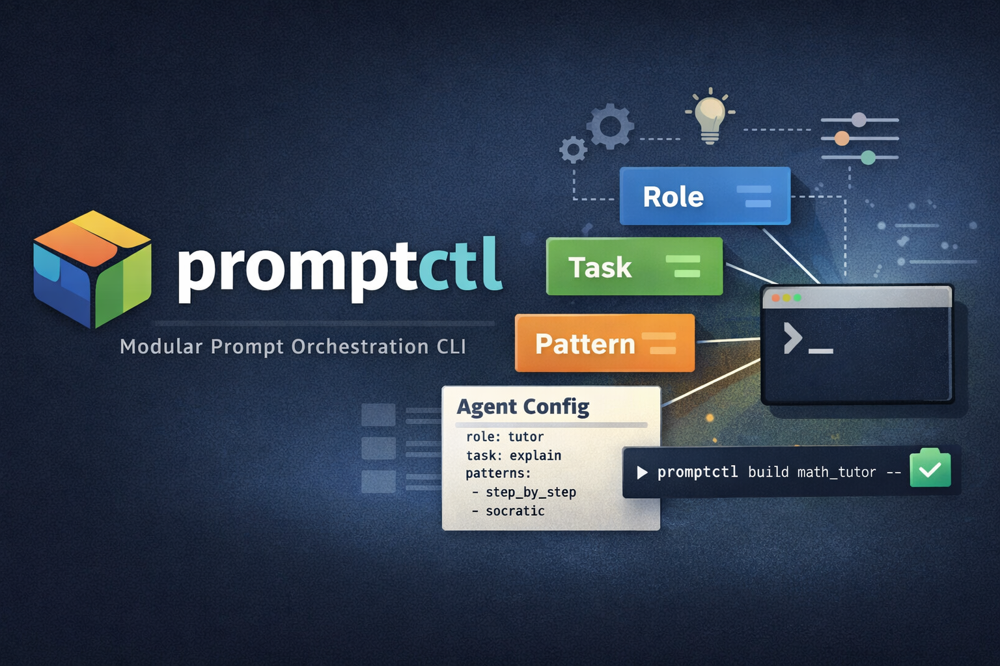

# promptctl

<p align="center">
  
</p>

<p align="center">
  <strong>A control plane for composable AI prompting.</strong>
</p>

## Overview

promptctl is a modular CLI for composing, managing, and orchestrating reusable AI prompt components.

Instead of storing static snippets, promptctl treats prompts as structured building blocks — roles, tasks, and reasoning patterns — that can be assembled, parameterized, and reused across projects.

Designed for users who think in systems, not snippets.

## Why promptctl?

- 🧱 Modular prompt components
- 🧠 Role + task + pattern composition
- 🔁 Agent presets
- 🧩 Variable injection
- 📋 Clipboard export
- ⚡ Terminal-native workflow
- 🗂 Version-controlled prompts

## Installation

```bash
git clone https://github.com/yourname/promptctl.git
cd promptctl
chmod +x promptctl.sh
sudo ln -s $(pwd)/promptctl.sh /usr/local/bin/promptctl
```
