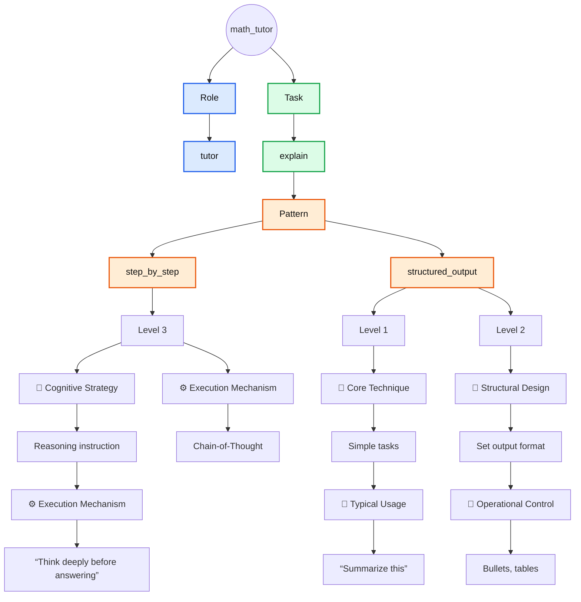
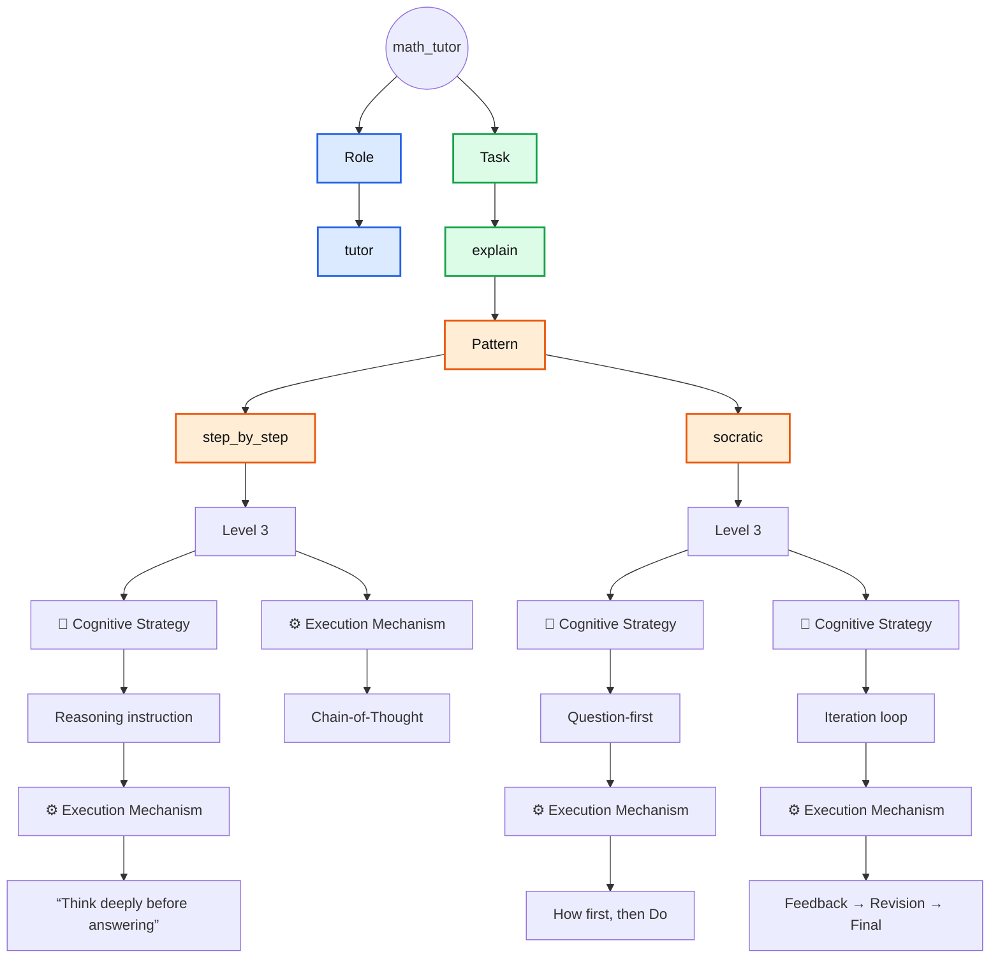

# Default Agents

The columns that follow **Pattern** represent matches with corresponding elements in [The Iceberg Of Prompting](../../the_iceberg_of_prompting.md) framework.

## action_agent

TODO: ChatGTP

## cs_instructor

| Role                 | Task    | Pattern           | 🧠 Cognitive Strategy | ⚙️ Execution Mechanism          |
|----------------------|---------|-------------------|-----------------------|---------------------------------|
| technical_instructor | explain | step_by_step      | Reasoning instruction | “Think deeply before answering” |
| technical_instructor | explain | step_by_step      | —                     | Chain-of-Thought                |

| Role                 | Task    | Pattern           | 🧩 Core Technique     | 🎯 Typical Usage                |
|----------------------|---------|-------------------|-----------------------|---------------------------------|
| technical_instructor | explain | structured_output |Simple tasks           |“Summarize this”                 |

| Role                 | Task    | Pattern           | 📐 Structural Design  | 🚦 Operational Control          |
|----------------------|---------|-------------------|-----------------------|---------------------------------|
| technical_instructor | explain | structured_output |Set output format      |Bullets, tables                  |

## math_tutor

| Role  | Task    | Pattern        | 🧠 Cognitive Strategy | ⚙️ Execution Mechanism            |
|-------|---------|----------------|-----------------------|-----------------------------------|
| tutor | explain | step_by_step   | Reasoning instruction | “Think deeply before answering”   |
| tutor | explain | step_by_step   | —                     | Chain-of-Thought                  |
| tutor | explain | socratic       | Question-first        | How first, then Do                |
| tutor | explain | socratic       | Iteration loop        | Feedback → Revision → Final       |

