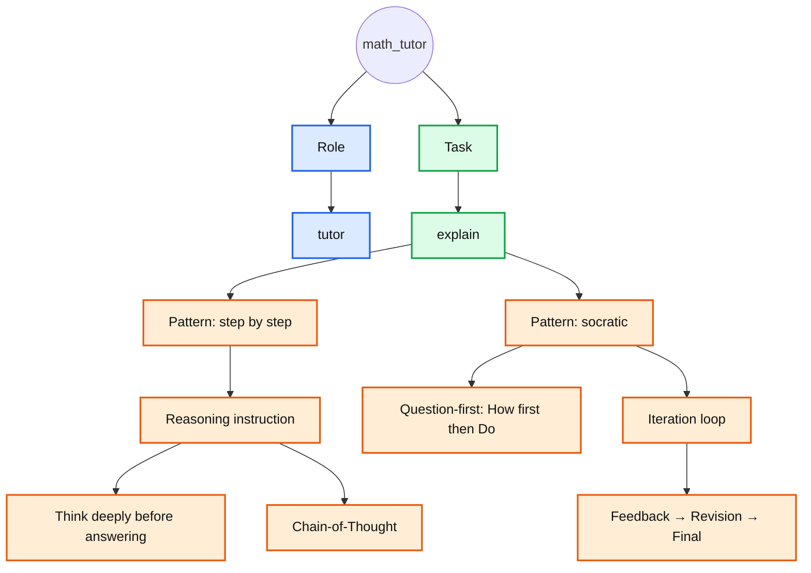

# Default Agents

**Full Match** and **Partial Match** columns correspond to **items** from [The Iceberg Of Prompting](../../the_iceberg_of_prompting.md) framework.

## cs_instructor

TODO:

## math_tutor

|Role|Task|Patterns|Full Matches|Partial Matches|
|----|----|--------|------------|---------------|
|tutor|explain|step by step|Reasoning instruction (Think deeply before answering,	Chain-of-Thought) |-|
| | |socratic|Question-first (How first, then Do). Iteration loop (Feedback → Revision → Final)|-|

